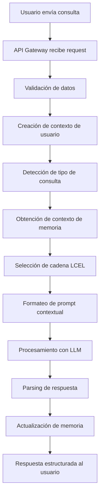

# Backend SIEM Tracker IA - Documentación Técnica

## 📋 Índice

1. [Visión General](#visión-general)
2. [Arquitectura del Sistema](#arquitectura-del-sistema)
3. [Pipeline de Procesamiento](#pipeline-de-procesamiento)
4. [Componentes Principales](#componentes-principales)
5. [Flujo de Datos](#flujo-de-datos)
6. [API Endpoints](#api-endpoints)
7. [Configuración y Despliegue](#configuración-y-despliegue)
8. [Monitoreo y Logs](#monitoreo-y-logs)
9. [Troubleshooting](#troubleshooting)

## 🎯 Visión General

El backend de SIEM Tracker IA es un sistema de inteligencia artificial especializado en comercio exterior que utiliza **LangChain avanzado** para proporcionar respuestas contextuales, memoria persistente y análisis inteligente de operaciones logísticas.

### Características Principales

- 🤖 **Chatbot Inteligente**: Agente especializado en comercio exterior con memoria persistente
- 🧠 **Sistema de Memoria Avanzado**: Múltiples tipos de memoria integrados con SQLite
- 📝 **Plantillas Dinámicas**: Prompts contextuales y few-shot learning
- 🔄 **Pipeline LCEL**: Flujos de procesamiento modulares y escalables
- 📊 **Output Parsers**: Respuestas estructuradas con validación Pydantic
- 🔌 **Integración Real**: Conexión directa con el backend de SIEM

## 🏗️ Arquitectura del Sistema

### Diagrama de Arquitectura

```
┌─────────────────────────────────────────────────────────────────┐
│                        FRONTEND LAYER                          │
│  ┌─────────────────┐  ┌─────────────────┐  ┌─────────────────┐  │
│  │   React App     │  │   Chat Widget   │  │   Admin Panel   │  │
│  └─────────────────┘  └─────────────────┘  └─────────────────┘  │
└─────────────────────┬───────────────────────────────────────────┘
                      │ HTTP/WebSocket
┌─────────────────────▼───────────────────────────────────────────┐
│                      API GATEWAY                               │
│  ┌─────────────────┐  ┌─────────────────┐  ┌─────────────────┐  │
│  │   FastAPI       │  │   CORS          │  │   Auth          │  │
│  │   Middleware    │  │   Security      │  │   Validation    │  │
│  └─────────────────┘  └─────────────────┘  └─────────────────┘  │
└─────────────────────┬───────────────────────────────────────────┘
                      │
┌─────────────────────▼───────────────────────────────────────────┐
│                   CHATBOT ORCHESTRATOR                         │
│  ┌─────────────────┐  ┌─────────────────┐  ┌─────────────────┐  │
│  │  Enhanced       │  │  Memory         │  │  Prompt         │  │
│  │  Chatbot Agent  │  │  Manager        │  │  Templates      │  │
│  └─────────────────┘  └─────────────────┘  └─────────────────┘  │
│  ┌─────────────────┐  ┌─────────────────┐  ┌─────────────────┐  │
│  │  Output         │  │  Data           │  │  Context        │  │
│  │  Parsers        │  │  Retriever      │  │  Manager        │  │
│  └─────────────────┘  └─────────────────┘  └─────────────────┘  │
└─────────────────────┬───────────────────────────────────────────┘
                      │
┌─────────────────────▼───────────────────────────────────────────┐
│                    LANGCHAIN CORE                              │
│  ┌─────────────────┐  ┌─────────────────┐  ┌─────────────────┐  │
│  │   Chat Models   │  │    Memory       │  │   Prompts       │  │
│  │   (LM Studio)   │  │    Systems      │  │   Templates     │  │
│  └─────────────────┘  └─────────────────┘  └─────────────────┘  │
│  ┌─────────────────┐  ┌─────────────────┐  ┌─────────────────┐  │
│  │   Output        │  │   Runnable      │  │   Chains        │  │
│  │   Parsers       │  │   Chains        │  │   (LCEL)        │  │
│  └─────────────────┘  └─────────────────┘  └─────────────────┘  │
└─────────────────────┬───────────────────────────────────────────┘
                      │
┌─────────────────────▼───────────────────────────────────────────┐
│                  EXTERNAL SERVICES                             │
│  ┌─────────────────┐  ┌─────────────────┐  ┌─────────────────┐  │
│  │   LM Studio     │  │   SIEM Backend  │  │   SQLite DB     │  │
│  │   (LLM)         │  │   (Data API)    │  │   (Memory)      │  │
│  └─────────────────┘  └─────────────────┘  └─────────────────┘  │
└─────────────────────────────────────────────────────────────────┘
```

### Componentes por Capa

#### **1. Frontend Layer**
- **React App**: Interfaz principal del sistema
- **Chat Widget**: Componente de chat integrado
- **Admin Panel**: Panel de administración

#### **2. API Gateway**
- **FastAPI**: Framework web asíncrono
- **CORS**: Configuración de acceso cruzado
- **Auth**: Autenticación JWT
- **Validation**: Validación de datos con Pydantic

#### **3. Chatbot Orchestrator**
- **Enhanced Chatbot Agent**: Agente principal mejorado
- **Memory Manager**: Gestión de memoria multicapa
- **Prompt Templates**: Plantillas dinámicas
- **Output Parsers**: Parsers de salida estructurada
- **Data Retriever**: Obtención de datos reales
- **Context Manager**: Gestión de contexto de usuario

#### **4. LangChain Core**
- **Chat Models**: Modelos de lenguaje (LM Studio)
- **Memory Systems**: Sistemas de memoria de LangChain
- **Prompts**: Plantillas y formateo de prompts
- **Output Parsers**: Parsers de salida
- **Runnable Chains**: Cadenas ejecutables (LCEL)

#### **5. External Services**
- **LM Studio**: Servidor local de LLM
- **SIEM Backend**: API de datos reales
- **SQLite DB**: Base de datos de memoria persistente

## 🔄 Pipeline de Procesamiento

### Flujo Principal de Procesamiento



### Tipos de Consultas y Cadenas

#### **1. Consultas de Datos (`data_query`)**
```
Input → Data Query Chain → LLM → Data Parser → Structured Response
```

**Características:**
- Acceso a datos reales del sistema SIEM
- Análisis estadístico y métricas
- Respuestas con datos estructurados
- Integración con memoria de entidades

#### **2. Consultas de Regulaciones (`regulation_query`)**
```
Input → Regulation Chain → LLM → Regulation Parser → Structured Response
```

**Características:**
- Información sobre normativas aduaneras
- Documentos requeridos y procedimientos
- Referencias a SAT y regulaciones internacionales
- Respuestas con fuentes citadas

#### **3. Consultas de Procesos (`process_query`)**
```
Input → Process Chain → LLM → Process Parser → Structured Response
```

**Características:**
- Guías paso a paso de procedimientos
- Flujos de trabajo optimizados
- Mejores prácticas del sector
- Respuestas estructuradas por pasos

#### **4. Análisis de Operaciones (`operation_analysis`)**
```
Input → Operation Chain → LLM → Operation Parser → Structured Response
```

**Características:**
- Análisis detallado de operaciones específicas
- Identificación de riesgos y oportunidades
- Próximos pasos recomendados
- Métricas de confianza

#### **5. Consultas Generales (`general_query`)**
```
Input → General Chain → LLM → General Parser → Structured Response
```

**Características:**
- Respuestas generales sobre comercio exterior
- Ayuda contextual según el usuario
- Integración con memoria de conversación
- Sugerencias de seguimiento

## 🧩 Componentes Principales

### 1. **Enhanced Chatbot Agent** (`enhanced_chatbot_agent.py`)

**Responsabilidades:**
- Orquestación principal del sistema
- Detección de tipos de consulta
- Coordinación entre componentes
- Gestión del flujo de procesamiento

**Clases Principales:**
```python
class EnhancedSIEMChatbotAgent:
    def __init__(self, siem_base_url, siem_api_token)
    async def process_chat(self, messages, user_context)
    def _detect_query_type(self, message)
    async def _handle_data_query(self, chain_input)
    async def _handle_regulation_query(self, chain_input)
    async def _handle_process_query(self, chain_input)
    async def _handle_operation_analysis(self, chain_input)
    async def _handle_general_query(self, chain_input)
```

**Flujo de Procesamiento:**
1. Recibe mensajes y contexto del usuario
2. Detecta el tipo de consulta automáticamente
3. Obtiene contexto de memoria relevante
4. Selecciona la cadena LCEL apropiada
5. Procesa la consulta con el LLM
6. Parsea la respuesta a formato estructurado
7. Actualiza la memoria con la nueva conversación
8. Retorna respuesta enriquecida al usuario

### 2. **Memory Manager** (`memory_manager.py`)

**Responsabilidades:**
- Gestión de memoria multicapa
- Persistencia en SQLite
- Extracción de entidades
- Resúmenes automáticos

**Tipos de Memoria:**
```python
# Memoria de corto plazo (últimos 10 mensajes)
ConversationBufferWindowMemory(k=10)

# Memoria de resumen (para conversaciones largas)
ConversationSummaryMemory(llm=llm)

# Memoria de entidades (operaciones, clientes, etc.)
ConversationEntityMemory(llm=llm)

# Memoria combinada (integración de todas)
CombinedMemory(memories=[...])
```

**Base de Datos SQLite:**
```sql
-- Entidades de conversación
CREATE TABLE conversation_entities (
    id INTEGER PRIMARY KEY,
    session_id TEXT NOT NULL,
    entity_type TEXT NOT NULL,
    entity_name TEXT NOT NULL,
    entity_data TEXT NOT NULL,
    created_at TIMESTAMP,
    updated_at TIMESTAMP
);

-- Resúmenes de conversación
CREATE TABLE conversation_summaries (
    id INTEGER PRIMARY KEY,
    session_id TEXT NOT NULL,
    summary TEXT NOT NULL,
    message_count INTEGER NOT NULL,
    created_at TIMESTAMP
);

-- Contexto de sesión
CREATE TABLE session_context (
    session_id TEXT PRIMARY KEY,
    user_id TEXT NOT NULL,
    user_type TEXT NOT NULL,
    current_page TEXT,
    created_at TIMESTAMP,
    last_activity TIMESTAMP,
    message_count INTEGER,
    context_data TEXT
);
```

### 3. **Prompt Templates** (`prompt_templates.py`)

**Responsabilidades:**
- Plantillas dinámicas de prompts
- Few-shot learning
- Contexto específico por usuario
- Adaptación según página actual

**Tipos de Plantillas:**
```python
# Plantilla base del sistema
system_base = ChatPromptTemplate.from_messages([...])

# Plantillas especializadas
data_query_template = ChatPromptTemplate.from_messages([...])
regulation_query_template = ChatPromptTemplate.from_messages([...])
process_query_template = ChatPromptTemplate.from_messages([...])
operation_analysis_template = ChatPromptTemplate.from_messages([...])

# Plantillas few-shot
few_shot_data_query = FewShotPromptTemplate(...)
few_shot_regulation_query = FewShotPromptTemplate(...)
```

**Contexto Dinámico:**
- **Por tipo de usuario**: SIEM vs Cliente
- **Por página actual**: /operations, /clients, /customs, etc.
- **Por tipo de consulta**: Datos, regulaciones, procesos, etc.

### 4. **Output Parsers** (`output_parsers.py`)

**Responsabilidades:**
- Parsing de respuestas a formato estructurado
- Validación con modelos Pydantic
- Extracción de entidades
- Metadatos de respuesta

**Modelos Pydantic:**
```python
class OperationAnalysis(BaseModel):
    operation_code: str
    status: str
    priority: str
    next_steps: List[str]
    risks: List[str]
    opportunities: List[str]
    estimated_completion: Optional[str]
    confidence_score: float

class DataSummary(BaseModel):
    total_count: int
    summary_by_category: Dict[str, int]
    key_insights: List[str]
    recommendations: List[str]
    data_quality: str
    limitations: List[str]

class RegulationInfo(BaseModel):
    regulation_type: str
    applicable_laws: List[str]
    requirements: List[str]
    documents_needed: List[str]
    deadlines: List[str]
    penalties: List[str]
    exceptions: List[str]
```

**Parsers Especializados:**
- `OperationAnalysisParser`: Análisis de operaciones
- `DataSummaryParser`: Resúmenes de datos
- `SIEMOutputParser`: Parser general
- `SIEMParserFactory`: Factory de parsers

### 5. **Data Retriever** (`chatbot_agent_real_data.py`)

**Responsabilidades:**
- Conexión con backend real de SIEM
- Obtención de datos en tiempo real
- Autenticación y manejo de sesiones
- Formateo de datos para contexto

**Métodos Principales:**
```python
class SIEMDataRetriever:
    async def get_user_operations(self, user_id, user_type)
    async def get_user_tasks(self, user_id)
    async def get_user_clients(self, user_id)
    async def get_user_suppliers(self, user_id)
    async def get_user_customs(self, user_id)
```

**Integración con SIEM Backend:**
- Autenticación con cookies de sesión
- Paginación automática de resultados
- Manejo de errores y timeouts
- Cache de sesiones autenticadas

## 📊 Flujo de Datos

### 1. **Entrada de Datos**

```python
# Request del frontend
{
    "message": "¿Cuántas operaciones tengo activas?",
    "user_id": "carlos.martinez@siem.business",
    "context": {
        "user_type": "siem",
        "current_page": "/operations",
        "preferences": {...}
    },
    "session_id": "session_1234567890"
}
```

### 2. **Procesamiento Interno**

```python
# 1. Creación de contexto de usuario
user_context = EnhancedUserContext(
    user_id=request.user_id,
    user_type=request.context["user_type"],
    current_page=request.context["current_page"],
    session_id=request.session_id,
    preferences=request.context.get("preferences"),
    last_activity=datetime.now().isoformat()
)

# 2. Detección de tipo de consulta
query_type = agent._detect_query_type(request.message)
# Resultado: "data_query"

# 3. Obtención de contexto de memoria
memory_context = memory_manager.get_memory_variables(session_id)

# 4. Obtención de datos reales (si es consulta de datos)
if query_type == "data_query":
    data_context = await agent._get_real_data_context(user_context)

# 5. Selección de cadena LCEL
chain_input = {
    'messages': messages,
    'user_context': user_context,
    'memory_context': memory_context,
    'data_context': data_context
}

# 6. Procesamiento con cadena específica
response = await agent.data_query_chain.ainvoke(chain_input)
```

### 3. **Salida de Datos**

```python
# Respuesta estructurada
{
    "response": "Tienes 25 operaciones activas en el sistema...",
    "structured_data": {
        "total_count": 25,
        "summary_by_category": {
            "En proceso": 15,
            "Pendientes": 8,
            "Completadas": 2
        },
        "key_insights": ["Aumento del 20% vs mes anterior"],
        "recommendations": ["Revisar operaciones pendientes"]
    },
    "confidence": 0.9,
    "sources": ["Base de datos SIEM", "Datos en tiempo real"],
    "suggested_actions": ["Ver detalles completos", "Exportar datos"],
    "follow_up_questions": ["¿Te gustaría analizar alguna operación específica?"],
    "model_used": "gpt-4o-mini",
    "timestamp": "2024-01-15T10:30:00Z",
    "session_id": "session_1234567890",
    "memory_used": true,
    "entities_extracted": ["SOD25-058", "Cliente ABC"]
}
```

## 🔌 API Endpoints

### **1. Chat Principal**
```http
POST /api/chatbot/chat
Content-Type: application/json

{
    "message": "¿Cuántas operaciones tengo activas?",
    "user_id": "carlos.martinez@siem.business",
    "context": {
        "user_type": "siem",
        "current_page": "/operations"
    },
    "session_id": "session_1234567890"
}
```

**Respuesta:**
```json
{
    "response": "Tienes 25 operaciones activas...",
    "structured_data": {...},
    "confidence": 0.9,
    "sources": [...],
    "suggested_actions": [...],
    "follow_up_questions": [...],
    "model_used": "gpt-4o-mini",
    "timestamp": "2024-01-15T10:30:00Z",
    "session_id": "session_1234567890",
    "memory_used": true,
    "entities_extracted": [...]
}
```

### **2. Análisis de Operación**
```http
POST /api/chatbot/analyze-operation?operation_code=SOD25-058
Authorization: Bearer <token>
```

**Respuesta:**
```json
{
    "operation_code": "SOD25-058",
    "analysis": "La operación SOD25-058 está en proceso...",
    "structured_data": {
        "operation_code": "SOD25-058",
        "status": "En proceso",
        "priority": "alta",
        "next_steps": ["Revisar documentos", "Contactar cliente"],
        "risks": ["Documentos pendientes"],
        "opportunities": ["Optimización de proceso"],
        "confidence_score": 0.9
    },
    "confidence": 0.9,
    "suggested_actions": [...],
    "follow_up_questions": [...],
    "entities_extracted": [...],
    "memory_used": true,
    "timestamp": "2024-01-15T10:30:00Z"
}
```

### **3. Historial de Conversación**
```http
GET /api/chatbot/conversation/{session_id}
Authorization: Bearer <token>
```

### **4. Limpiar Conversación**
```http
DELETE /api/chatbot/conversation/{session_id}
Authorization: Bearer <token>
```

### **5. Sugerencias**
```http
GET /api/chatbot/suggestions
Authorization: Bearer <token>
```

### **6. Health Check**
```http
GET /api/chatbot/health
```

## ⚙️ Configuración y Despliegue

### **1. Variables de Entorno**

```bash
# Configuración del LLM
LM_STUDIO_URL=http://localhost:1234
LM_STUDIO_MODEL=openai/gpt-oss-20b

# Configuración de SIEM
SIEM_API_BASE_URL=http://localhost:8000
SIEM_API_TOKEN=your-token

# Configuración de la aplicación
ENVIRONMENT=development
HOST=0.0.0.0
PORT=8001

# Configuración de base de datos
DATABASE_URL=sqlite:///./siem_memory.db
```

### **2. Instalación de Dependencias**

```bash
# Crear entorno virtual
python -m venv venv
source venv/bin/activate  # Linux/Mac
# o
venv\Scripts\activate  # Windows

# Instalar dependencias
pip install -r requirements.txt
```

### **3. Inicialización de Base de Datos**

```python
# La base de datos se inicializa automáticamente
# Al ejecutar el servidor por primera vez
python main.py
```

### **4. Ejecución del Servidor**

```bash
# Desarrollo
python main.py

# Producción con Gunicorn
gunicorn main:app -w 4 -k uvicorn.workers.UvicornWorker --bind 0.0.0.0:8001
```

### **5. Docker (Opcional)**

```dockerfile
FROM python:3.9-slim

WORKDIR /app
COPY requirements.txt .
RUN pip install -r requirements.txt

COPY . .
EXPOSE 8001

CMD ["python", "main.py"]
```

## 📈 Monitoreo y Logs

### **1. Logs del Sistema**

```python
# Configuración de logging
logging.basicConfig(
    level=logging.INFO,
    format='%(asctime)s - %(name)s - %(levelname)s - %(message)s'
)
```

**Tipos de Logs:**
- **INFO**: Operaciones normales del sistema
- **DEBUG**: Información detallada de debugging
- **WARNING**: Situaciones que requieren atención
- **ERROR**: Errores que no detienen el sistema
- **CRITICAL**: Errores críticos que detienen el sistema

### **2. Métricas de Rendimiento**

```python
# Métricas automáticas
{
    "timestamp": "2024-01-15T10:30:00Z",
    "session_id": "session_1234567890",
    "user_id": "carlos.martinez@siem.business",
    "user_type": "siem",
    "current_page": "/operations",
    "query_type": "data_query",
    "processing_time_ms": 1250,
    "memory_used": true,
    "entities_extracted": ["SOD25-058"],
    "confidence": 0.9,
    "response_length": 1250
}
```

### **3. Monitoreo de Base de Datos**

```sql
-- Consultar uso de memoria por sesión
SELECT 
    session_id,
    COUNT(*) as entity_count,
    MAX(updated_at) as last_activity
FROM conversation_entities 
GROUP BY session_id 
ORDER BY entity_count DESC;

-- Consultar resúmenes generados
SELECT 
    session_id,
    message_count,
    created_at,
    LENGTH(summary) as summary_length
FROM conversation_summaries 
ORDER BY created_at DESC;

-- Consultar contexto de sesiones activas
SELECT 
    session_id,
    user_id,
    user_type,
    current_page,
    message_count,
    last_activity
FROM session_context 
WHERE last_activity > datetime('now', '-1 hour')
ORDER BY last_activity DESC;
```

### **4. Health Checks**

```python
# Endpoint de health check
@app.get("/health")
async def health_check():
    return {
        "status": "healthy",
        "timestamp": datetime.now().isoformat(),
        "active_sessions": len(conversation_storage),
        "model": "gpt-4o-mini",
        "memory_db_status": "connected",
        "siem_backend_status": "connected"
    }
```

## 🔧 Troubleshooting

### **1. Problemas Comunes**

#### **Error: "No se puede conectar a LM Studio"**
```bash
# Verificar que LM Studio esté ejecutándose
curl http://localhost:1234/v1/models

# Verificar configuración
echo $LM_STUDIO_URL
echo $LM_STUDIO_MODEL
```

#### **Error: "Base de datos bloqueada"**
```bash
# Verificar procesos que usan la base de datos
lsof siem_memory.db

# Reiniciar el servidor
pkill -f "python main.py"
python main.py
```

#### **Error: "No se pueden obtener datos de SIEM"**
```bash
# Verificar conectividad
curl -X GET "https://dev-siem-tracker-backend-935390491354.us-central1.run.app/api/operations/" \
  -H "Cookie: sessionid=bvrlbhka915u4gav0fr7u0ixgg9iq6ao; csrftoken=L5Ypbk5doh15jyem8GirJ3lmn2sxb4X3"
```

### **2. Debugging**

#### **Habilitar Logs Detallados**
```python
# En main.py
logging.basicConfig(level=logging.DEBUG)
```

#### **Probar Componentes Individualmente**
```bash
# Probar memoria
python -c "from memory_manager import get_memory_manager; print('Memory OK')"

# Probar plantillas
python -c "from prompt_templates import get_prompt_templates; print('Templates OK')"

# Probar parsers
python -c "from output_parsers import get_parser; print('Parsers OK')"

# Probar agente completo
python test_enhanced_integration.py
```

### **3. Optimización de Rendimiento**

#### **Configuración de Memoria**
```python
# Ajustar tamaño de buffer de memoria
ConversationBufferWindowMemory(k=5)  # Reducir de 10 a 5

# Ajustar límite de tokens para resúmenes
ConversationSummaryMemory(max_token_limit=50)  # Reducir de 100 a 50
```

#### **Configuración de LLM**
```python
# Reducir temperatura para respuestas más consistentes
ChatOpenAI(temperature=0.5)

# Reducir max_tokens para respuestas más cortas
ChatOpenAI(max_tokens=1000)
```

### **4. Mantenimiento de Base de Datos**

#### **Limpieza de Datos Antiguos**
```sql
-- Eliminar entidades de sesiones inactivas (más de 30 días)
DELETE FROM conversation_entities 
WHERE session_id IN (
    SELECT session_id FROM session_context 
    WHERE last_activity < datetime('now', '-30 days')
);

-- Eliminar resúmenes antiguos
DELETE FROM conversation_summaries 
WHERE created_at < datetime('now', '-30 days');

-- Eliminar contexto de sesiones inactivas
DELETE FROM session_context 
WHERE last_activity < datetime('now', '-30 days');
```

#### **Optimización de Base de Datos**
```sql
-- Crear índices para mejorar rendimiento
CREATE INDEX idx_conversation_entities_session_id ON conversation_entities(session_id);
CREATE INDEX idx_conversation_entities_type ON conversation_entities(entity_type);
CREATE INDEX idx_session_context_user_id ON session_context(user_id);
CREATE INDEX idx_session_context_last_activity ON session_context(last_activity);

-- Analizar y optimizar base de datos
ANALYZE;
VACUUM;
```

## 📚 Referencias y Recursos

### **Documentación LangChain**
- [LangChain Core](https://python.langchain.com/docs/langchain_core)
- [Memory Management](https://python.langchain.com/docs/modules/memory)
- [Prompt Templates](https://python.langchain.com/docs/modules/model_io/prompts)
- [Output Parsers](https://python.langchain.com/docs/modules/model_io/output_parsers)

### **Documentación FastAPI**
- [FastAPI Documentation](https://fastapi.tiangolo.com/)
- [Pydantic Models](https://pydantic-docs.helpmanual.io/)

### **Documentación SQLite**
- [SQLite Documentation](https://www.sqlite.org/docs.html)
- [SQLite Python](https://docs.python.org/3/library/sqlite3.html)

---

**Versión**: 2.0.0  
**Última actualización**: Enero 2024  
**Mantenido por**: Equipo de Desarrollo SIEM  
**Contacto**: desarrollo@siem.business

